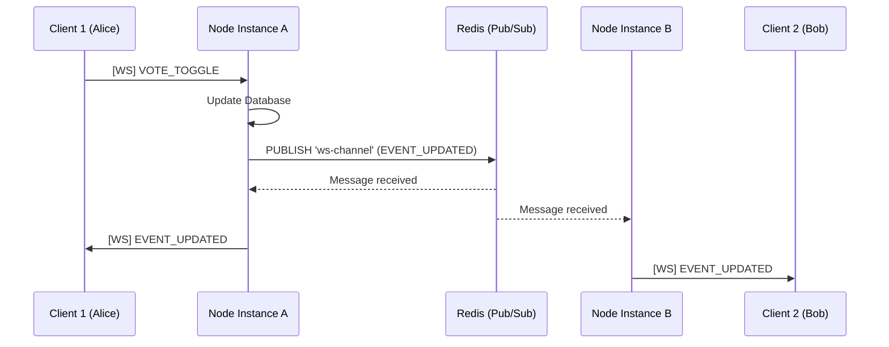

# 🚀 Scaling WebSockets with Redis

When a WebSocket server runs on a single Node.js instance, it maintains a local memory map of all connected clients (`wss.clients`). When an event occurs (e.g., someone votes), the server loops through these local clients and sends them the update.

## The Scaling Problem
If your application grows and you deploy **multiple Node.js instances** (e.g., 3 instances behind a load balancer), a user connected to **Instance A** won't receive live updates if the vote was cast by a user connected to **Instance B**. Why? Because Instance A doesn't know about the activity on Instance B.

## The Redis Pub/Sub Solution
To solve this, we introduced **Redis Pub/Sub (Publish/Subscribe)** as a central message broker.

### How it works:
1. **Two Redis Connections**: Every Node.js instance creates *two* connections to Redis: one for publishing messages (`pubClient`) and one strictly for listening/subscribing (`subClient`).
2. **Publishing**: When Instance A processes a vote, it publishes a message to a Redis channel (e.g., `beervote:ws:events`).
3. **Subscribing**: ALL instances (including Instance A and Instance B) are subscribed to this channel.
4. **Broadcasting**: When an instance receives a message from Redis, it broadcasts that payload to all of its *locally connected* WebSocket clients.

---

## Architecture Implementation Details

The Redis Pub/Sub architecture for WebSockets has been successfully integrated into BeerVote. Here is a summary of the implemented changes:

### 1. Redis Integration (`server/redis.ts`)
Created a dedicated module to handle Redis connections and Pub/Sub logic using the `ioredis` package.
- **Graceful Fallback**: The system checks for the `REDIS_URL` environment variable on startup. If not present, the app elegantly falls back to the original in-memory local broadcasting mechanism, meaning **local development does not force you to run a Redis server!**
- **Pub/Sub Logic**: Implemented `publishEventUpdate`, `publishDashboardUpdate`, and `publishEventDeleted` to broadcast updates over the `beervote:ws:events` channel.
- **Subscriber Handling**: The server listens for messages on the channel and routes them to the locally connected WebSocket clients.

### 2. Refactored WebSockets (`server/websocket/server.ts`)
- Modified the original broadcasting functions (`broadcastEventUpdate`, etc.) into `broadcastToLocalClients`. These are now strictly responsible for sending messages to local WebSockets, decoupled from the mutation logic.

### 3. Updated Event Handlers
- **`server/websocket/handlers.ts`**: All WebSocket mutation endpoints (VOTE_TOGGLE, ADD_COMMENT, etc.) now call the `publish*` functions from the new Redis module.
- **`server/routes/events.ts`**: REST API endpoints (like deleting an event or creating one) also utilize the `publish*` functions.

### 4. Automatic Initialization
- Updated `server/index.ts` to automatically call `initRedis()` alongside `initWebSocketServer()` when the application starts.
