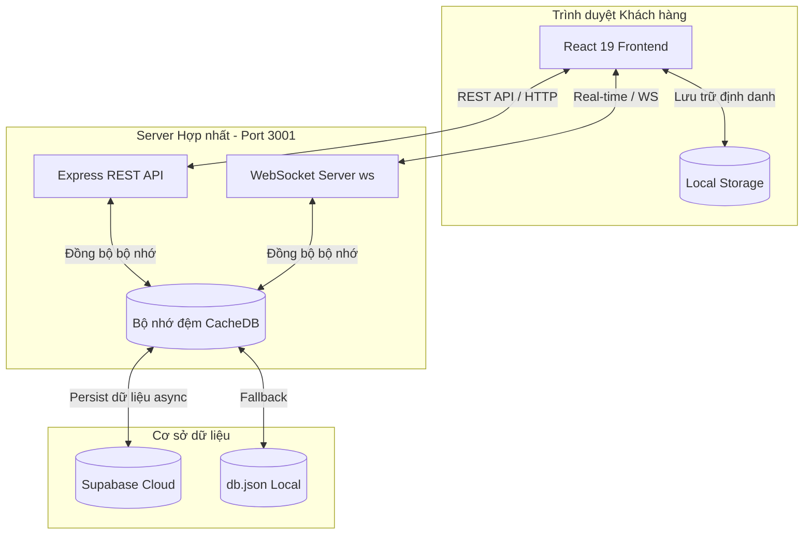
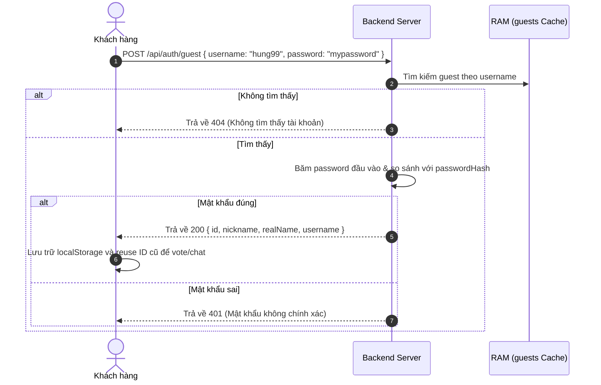

# Tài Liệu Kiến Trúc Hệ Thống & Luồng Hoạt Động - BeerVote 🍻

Tài liệu này cung cấp cái nhìn chi tiết và toàn diện về cách thức hoạt động của ứng dụng **BeerVote** (cả Frontend và Backend) dành cho lập trình viên và các kỹ sư phát triển.

---

## 1. Tổng quan hệ thống (System Overview)

**BeerVote** là ứng dụng bình chọn kèo ăn nhậu thời gian thực (Real-time). Người dùng có thể tạo sòng nhậu, đề xuất nhiều tùy chọn (ngày giờ, địa điểm, loại bia), mời bạn bè tham gia bình chọn và thảo luận cùng nhau qua hộp chat trực tuyến.



---

## 2. Mô hình Dữ liệu (Data Model)

Hệ thống hoạt động xoay quanh 5 thực thể chính: `Events` (Kèo nhậu) ➔ `Options` (Đề xuất) ➔ `Votes` (Lượt bình chọn) ➔ `Comments` (Tin nhắn thảo luận) và `Guests` (Quản lý tài khoản khách kèm mật khẩu băm).

### Cấu trúc cơ sở dữ liệu (`server/db.json` hoặc Supabase):

```json
{
  "events": [
    {
      "id": "uuid-chuỗi-định-danh",
      "title": "Tên kèo nhậu",
      "creatorId": "id-người-tạo",
      "creatorName": "Tên hiển thị người tạo",
      "creatorToken": "token-bí-mật-quyền-chủ-kèo",
      "partyPinHash": "mã-băm-sha256-nếu-có",
      "status": "voting | locked",
      "createdAt": "ISO-string",
      "lockedAt": null,
      "finalDateTime": null,
      "finalLocation": null,
      "finalBeerStyle": null
    }
  ],
  "options": [
    {
      "id": "uuid-đề-xuất",
      "eventId": "id-kèo-nhậu-liên-kết",
      "type": "datetime | location | beer",
      "value": "Nội dung đề xuất (ví dụ: 19:30, Quán Ốc...)",
      "creatorId": "id-người-đề-xuất",
      "creatorName": "Tên người đề xuất",
      "createdAt": "ISO-string"
    }
  ],
  "votes": [
    {
      "id": "uuid-lượt-vote",
      "eventId": "id-kèo-nhậu",
      "optionId": "id-đề-xuất-được-vote",
      "userId": "id-người-vote",
      "userName": "Tên người vote"
    }
  ],
  "comments": [
    {
      "id": "uuid-bình-luận",
      "eventId": "id-kèo-nhậu",
      "userId": "id-người-chat",
      "userName": "Tên người chat",
      "userRole": "admin | guest",
      "content": "Nội dung chat",
      "createdAt": "ISO-string"
    }
  ],
  "guests": [
    {
      "id": "uuid-tài-khoản-khách",
      "username": "Tên đăng nhập / Email",
      "nickname": "Biệt danh chiến hữu",
      "realName": "Tên thật của chiến hữu",
      "passwordHash": "mã-băm-mật-khẩu-sha256",
      "createdAt": "ISO-string"
    }
  ]
}
```

---

## 3. Kiến trúc Backend (`server/index.ts`)

Ứng dụng chạy trên một cổng duy nhất (mặc định là `3001`) để xử lý đồng thời 3 tác vụ:

1. **HTTP REST API**: Xử lý các yêu cầu lấy danh sách kèo, tạo kèo mới, xác thực mã PIN, đăng ký/đăng nhập Khách và đăng nhập Google.
2. **WebSocket Server**: Quản lý các kết nối thời gian thực gửi nhận bình chọn (`VOTE_TOGGLE`), bình luận (`ADD_COMMENT`), và chốt kèo (`LOCK_EVENT`).
3. **Static File Server**: Phục vụ thư mục build của React (`dist/`) khi chạy ở môi trường Production.

### Cơ chế Dual-Mode Database & Memory Cache

Để tối ưu hóa tốc độ phản hồi real-time, toàn bộ dữ liệu được tải vào bộ nhớ đệm `cacheDB` khi khởi động server (`initDB`):

- **Cloud Mode**: Nếu có biến môi trường `SUPABASE_URL` và `SUPABASE_KEY`, hệ thống đọc/ghi một bản ghi JSON duy nhất trên bảng `beer_voter_data` làm DB chính.
- **Local Mode**: Nếu không có cấu hình Cloud, hệ thống tự động fallback ghi xuống file cục bộ `server/db.json`.
- **Async Persist (syncDB)**: Khi có thay đổi từ client (WebSockets/REST), hệ thống cập nhật lập tức vào `cacheDB` và thực hiện ghi đĩa không đồng bộ (asynchronous coalescing) để tránh tắc nghẽn luồng xử lý chính.

---

## 4. Bảo mật & Xác thực (Authentication & PIN Security)

Hệ thống áp dụng cơ chế xác thực phân tầng không trạng thái (stateless) cực kỳ linh hoạt:

### A. Đăng ký & Đăng nhập Khách Bảo mật (Secure Guest Authentication)

Để ngăn chặn các hành vi chiếm đoạt danh tính hoặc xem trộm lịch sử của chiến hữu khác, hệ thống cung cấp 2 Endpoint mới:

1. **Đăng ký Khách (`POST /api/auth/register-guest`)**:
   - Thu thập: `nickname`, `realName`, `username`, và `password`.
   - Kiểm tra trùng lặp `username` (không phân biệt chữ hoa/thường).
   - Mã hóa mật khẩu bằng thuật toán an toàn **SHA-256** qua hàm `hashPin` trước khi lưu vào `db.guests`.
2. **Đăng nhập Khách (`POST /api/auth/guest`)**:
   - Thu thập: `username` và `password`.
   - So khớp chữ ký băm mật khẩu `passwordHash`. Nếu đúng, cấp quyền truy cập, khôi phục ID cũ của khách hàng đó từ RAM, giúp người dùng đồng bộ hóa toàn bộ lịch sử bình chọn và chém gió trên mọi thiết bị mới.



### B. Cơ chế mã PIN bảo vệ kèo riêng tư (PIN Gating Flow)

Nếu kèo nhậu được bảo vệ bằng mã PIN 6 số:

1. Mã PIN được băm dưới dạng **SHA-256** (`partyPinHash`) trên server trước khi lưu trữ. Server không bao giờ trả về mã băm này cho Client.
2. Khi Client gửi yêu cầu truy cập, Server kiểm tra mã PIN qua endpoint `/api/events/:id/verify-pin`.
3. Nếu đúng PIN, Server cấp một **`pinToken`** ngẫu nhiên (UUID) có thời hạn 24 giờ (`expiresAt`), lưu vào bộ nhớ đệm `pinTokens` trên RAM server.
4. Client lưu `pinToken` này vào `localStorage` dưới khóa `beervote_pin_token_<eventId>`.
5. Tất cả các yêu cầu REST API (`X-Pin-Token` header) hoặc WebSocket (`pinToken` payload) kế tiếp bắt buộc phải đi kèm token hợp lệ này để được xử lý.

### C. Quyền Chủ Kèo (Creator Authority)

- Khi tạo kèo, Server phát hành một **`creatorToken`** (UUID) duy nhất trả về cho người tạo.
- `creatorToken` được lưu vào `localStorage` của máy chủ kèo dưới khóa `beervote_creator_token_<eventId>`.
- Các thao tác hủy chốt kèo (`UNLOCK_EVENT`), chốt kèo (`LOCK_EVENT`), và xóa kèo (`DELETE`) bắt buộc phải khớp `creatorToken` này để ngăn chặn hành vi phá hoại từ bên ngoài.

---

## 5. Giao thức WebSocket (WebSocket Protocol Messages)

Các gói tin gửi nhận thời gian thực qua giao thức WS có cấu trúc sau:

### Gửi từ Client lên Server (Client ➔ Server):

| Kiểu tin nhắn (`type`) | Payload đi kèm                                                                | Mục đích                                |
| :--------------------- | :---------------------------------------------------------------------------- | :-------------------------------------- |
| `JOIN_EVENT`           | `eventId`, `pinToken?`                                                        | Tham gia phòng kèo nhậu                 |
| `JOIN_DASHBOARD`       | _Không_                                                                       | Tham gia màn hình tổng hợp kèo          |
| `VOTE_TOGGLE`          | `eventId`, `optionId`, `userId`, `userName`, `pinToken?`                      | Bật/tắt lượt bình chọn cho đề xuất      |
| `ADD_OPTION`           | `eventId`, `optType`, `value`, `creatorId`, `creatorName`, `pinToken?`        | Đề xuất ý tưởng mới (Lịch/Địa điểm/Bia) |
| `ADD_COMMENT`          | `eventId`, `userId`, `userName`, `content`, `pinToken?`                       | Gửi tin nhắn chat trong kèo             |
| `LOCK_EVENT`           | `eventId`, `creatorToken`, `finalDateTime`, `finalLocation`, `finalBeerStyle` | Khóa bình chọn & chốt lịch nhậu         |
| `UNLOCK_EVENT`         | `eventId`, `creatorToken`                                                     | Mở lại bình chọn của kèo                |

### Gửi từ Server về Client (Server ➔ Client):

- **`EVENT_UPDATED`**: Trả về dữ liệu chi tiết mới nhất của kèo (`eventData`) cho tất cả các client đang xem kèo đó.
- **`DASHBOARD_UPDATED`**: Trả về danh sách tóm tắt tất cả các kèo cho các client đang xem màn hình danh sách.
- **`EVENT_DELETED`**: Thông báo kèo đã bị xóa để client tự động quay về trang chủ.

---

## 6. Hướng dẫn vận hành cho Nhà phát triển (Developer Guide)

### Khởi chạy môi trường Phát triển (Vite + Express):

```bash
npm run dev
```

- Vite Dev Server sẽ chạy ở cổng `5173`.
- Express Backend chạy ở cổng `3001`.
- Mọi API `/api/*` và kết nối WS từ cổng `5173` sẽ được Vite tự động chuyển tiếp (proxy) sang cổng `3001`.

### Build & Chạy Production:

```bash
npm run build
npm run start
```

- Ứng dụng sẽ biên dịch phần Frontend vào thư mục `dist/`.
- Lệnh `npm run start` khởi chạy một máy chủ Express duy nhất phục vụ cả Backend APIs lẫn các file tĩnh Frontend trên cổng `3001`.

### Rà soát Mã nguồn & Định dạng:

```bash
npm run lint          # Kiểm tra lỗi cú pháp ESLint
npx tsc --noEmit      # Kiểm tra lỗi kiểu TypeScript
npm run format        # Tự động định dạng code bằng Prettier
```

Hy vọng tài liệu này giúp bạn và đội ngũ phát triển nhanh chóng làm quen và làm chủ dự án **BeerVote**! Chúc anh em code mượt và nhậu vui! 🍻
