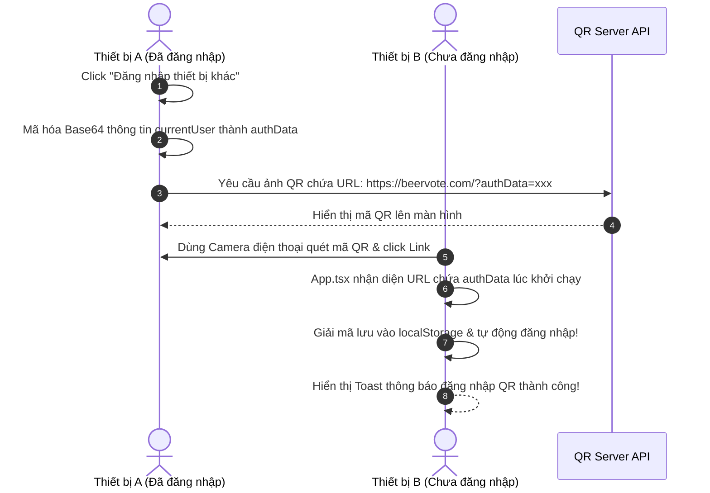

# Kế Hoạch Triển Khai Cải Tiến: Đăng nhập Khách Cũ kèm Mật Khẩu Bảo Mật & Quét Mã QR 🔐📱

Bản kế hoạch này tổng hợp hai giải pháp công nghệ lớn nhằm tối ưu hóa bảo mật và nâng cấp trải nghiệm người dùng đa thiết bị không ma sát (Frictionless) trên ứng dụng BeerVote.

---

## 1. Cơ Chế Đăng Nhập Khách Cũ Kèm Mật Khẩu 🔐

### A. Mô Hình Dữ Liệu (`DBGuest`)

Bổ sung thực thể lưu trữ thông tin khách hàng `guests` vào Database Schema:

```typescript
export interface DBGuest {
  id: string;
  username: string;
  nickname: string;
  realName: string;
  passwordHash: string; // Mã hóa SHA-256
  createdAt: string;
}
```

### B. Luồng Xác Thực (Hashing & Verification)

1. **Đăng ký**: Người dùng nhập mật khẩu plain-text, server sử dụng thuật toán băm **SHA-256** qua hàm `hashPin` để tạo chuỗi băm `passwordHash` và lưu trữ.
2. **Đăng nhập**: Server so sánh mật khẩu đầu vào sau khi băm với `passwordHash` đã lưu. Nếu khớp, trả về profile và ID cũ để client tự động liên kết dữ liệu cũ.

---

## 2. Tính Năng Đăng Nhập Nhanh Qua Mã QR Siêu Tốc 📱

### A. Luồng Hoạt Động Không Ma Sát (Frictionless QR Login)

Không cần cài đặt thư viện quét mã phức tạp ở điện thoại nhận diện, chúng ta sử dụng cơ chế mã hóa URL:



---

## 3. Các thay đổi đã thực hiện (Changes Implemented)

### Backend (`server/index.ts`)

- Tương thích ngược schema tự động.
- Tạo endpoint `POST /api/auth/register-guest` & `POST /api/auth/guest`.

### Frontend (`src/`)

- **`GuestJoinModal.tsx`**: Biểu mẫu Đăng ký/Đăng nhập Khách với trường Mật khẩu ẩn/hiển qua emoji `👁️`/`🙈` vui vẻ.
- **`Header.tsx`**: Nút kích hoạt mở Modal hiển thị mã QR liên kết an toàn qua API `qrserver.com`.
- **`App.tsx`**: Hook bắt khởi chạy ứng dụng quét URL nhận diện tham số `authData`, giải mã đăng nhập tức thì và làm sạch thanh địa chỉ.

Chúc dự án vận hành mượt mà! 🍻
