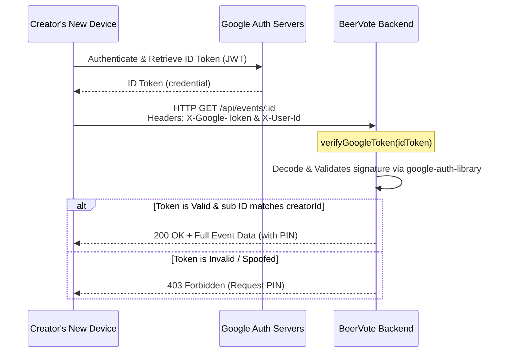

# Secure Cross-Device Creator Access

This document details the security vulnerability associated with naive `userId`-based cross-device room master (creator) authentication, and documents the implementation of **Option A: Secure Google-Only Cross-Device Access** to solve it.

---

## 1. The Impersonation Vulnerability

Originally, the room creator's administrative identity was strictly proven using a cryptographically random UUID `creatorToken`, stored exclusively in the browser's `localStorage` at `beervote_creator_token_<eventId>` on the original device. This kept the creator actions highly secure because the token was never exposed to other participants.

When implementing cross-device access:
* Rejoining and administering a party from a new device lacks the `creatorToken` in `localStorage`.
* A naive bypass matching the public `userId` against `event.creatorId` was introduced.
* **Security Threat**: Because user IDs are publicly visible to all participants (embedded in comments, votes, and option data), any malicious user could edit their `localStorage` or forge headers/WebSocket payloads to match the creator's `userId`, gaining unauthorized access to PIN-protected rooms and administrative actions (Lock, Unlock, Delete).

---

## 2. Secure Architecture (Option A)

To provide secure cross-device access without compromising security, we implemented **Option A: Secure Google-Only Cross-Device Access**.

### Authentication Flow Chart

### Key Security Guardrails

1. **Token Cryptography**: Google ID Tokens are cryptographically signed JWTs issued by Google. They cannot be forged by external users.
2. **Server Verification**: The backend verifies the signature, expiration, and audience of the token using Google's verification library (`google-auth-library`).
3. **`sub` ID Matching**: The verified `sub` ID from Google is compared directly against the `event.creatorId`. Even if a user presents their own valid Google ID Token, the backend rejects it because the Google unique ID (`sub`) will not match the creator's registered ID.

---

## 3. Code Modifications

### Backend (`server/`)
* **`server/utils/auth.ts`**: Implemented `verifyGoogleToken(idToken)` using the `google-auth-library` `verifyIdToken()` API.
* **`server/routes/events.ts`**:
  * Made `GET /api/events/:id` and `DELETE /api/events/:id` asynchronous.
  * Extracted the `X-Google-Token` header / `googleToken` parameter.
  * Integrated Google OAuth token validation if the `creatorToken` is missing.
* **`server/websocket/handlers.ts`**:
  * Destructured `googleToken` from incoming `WSAction` payloads.
  * Applied the Google token verification inside the `JOIN_EVENT`, `LOCK_EVENT`, and `UNLOCK_EVENT` WebSocket handlers.

### Frontend (`src/`)
* **`src/types/index.ts`**: Appended optional `googleToken` to the shared `User` interface.
* **`src/components/GuestJoinModal.tsx`**: Updated `onGoogleSuccess` to forward the raw `response.credential` (JWT ID Token).
* **`src/App.tsx`**:
  * Retained the raw credential string inside the user state and browser storage on Google sign-in.
  * Added `X-Google-Token` to HTTP header request payloads.
  * Appended `googleToken` to all critical `JOIN_EVENT`, `LOCK_EVENT`, and `UNLOCK_EVENT` WebSocket payloads.
  * Configured React Hook dependency arrays to re-join and update status whenever user authentication state changes.
